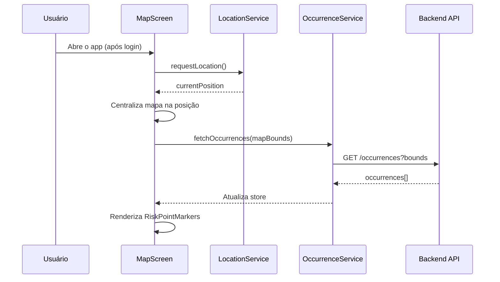
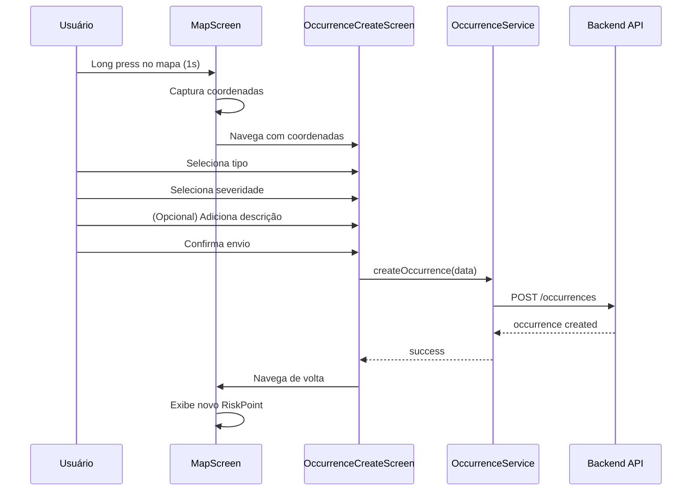
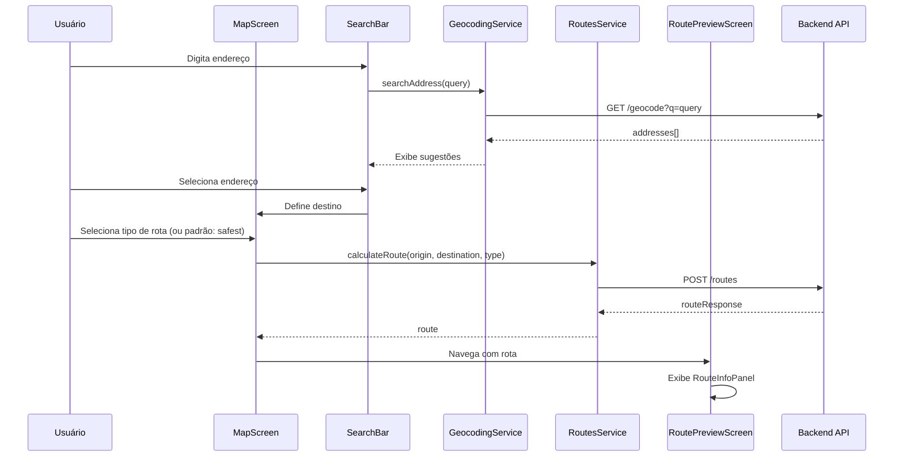
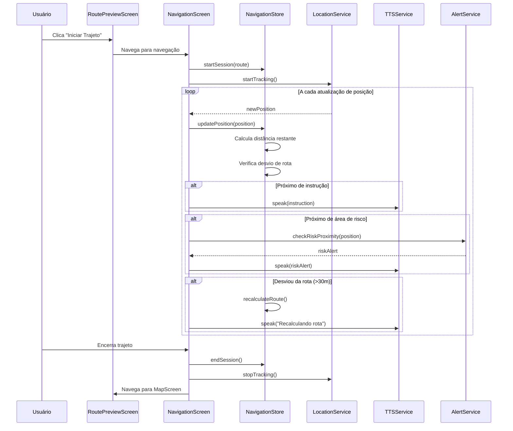

# Design Document

## Overview

Este documento descreve o design técnico para as funcionalidades pós-login do aplicativo Walking Safely Mobile. O sistema permite aos usuários visualizar sua localização no mapa, cadastrar e visualizar ocorrências de risco, buscar destinos, calcular rotas seguras e navegar com orientação em tempo real.

A arquitetura segue o padrão já estabelecido no projeto, utilizando React Native com TypeScript, Zustand para gerenciamento de estado, e integração com a API backend Laravel existente.

## Architecture

```mermaid
graph TB
    subgraph "Presentation Layer"
        MS[MapScreen]
        OCS[OccurrenceCreateScreen]
        RPS[RoutePreviewScreen]
        NS[NavigationScreen]
    end

    subgraph "Components"
        MV[MapView]
        SB[SearchBar]
        RP[RiskPointMarker]
        RPP[RiskPointPopup]
        RIP[RouteInfoPanel]
        IM[InstructionModal]
        MI[ManeuverIndicator]
        RAB[RiskAlertBanner]
        MuteBtn[MuteButton]
    end

    subgraph "State Management"
        MapStore[mapStore]
        NavStore[navigationStore]
        OccStore[occurrenceStore]
    end

    subgraph "Services"
        LocSvc[LocationService]
        RouteSvc[RoutesService]
        OccSvc[OccurrencesService]
        GeoSvc[GeocodingService]
        AlertSvc[AlertService]
        TTSSvc[TTSService]
    end

    subgraph "Backend API"
        API[Walking Safely API]
    end

    MS --> MV
    MS --> SB
    MS --> RP
    MS --> RPP
    OCS --> OccStore
    RPS --> RIP
    RPS --> IM
    NS --> MI
    NS --> RAB
    NS --> MuteBtn

    MV --> MapStore
    SB --> GeoSvc
    RP --> OccStore
    RIP --> NavStore
    MI --> NavStore
    RAB --> AlertSvc

    MapStore --> LocSvc
    NavStore --> RouteSvc
    OccStore --> OccSvc
    AlertSvc --> NavStore

    LocSvc --> API
    RouteSvc --> API
    OccSvc --> API
    GeoSvc --> API


## Components and Interfaces

### Screen Components

#### MapScreen
Tela principal do aplicativo após login. Exibe o mapa com localização do usuário e pontos de risco.

```typescript
interface MapScreenProps {
  // Navigation props from React Navigation
}

interface MapScreenState {
  isLoading: boolean;
  selectedRiskPoint: Occurrence | null;
  showOccurrencePopup: boolean;
  longPressCoordinates: Coordinates | null;
}
```

#### OccurrenceCreateScreen
Tela para cadastro de nova ocorrência de risco.

```typescript
interface OccurrenceCreateScreenProps {
  route: {
    params: {
      coordinates: Coordinates;
    };
  };
}

interface OccurrenceFormData {
  crimeTypeId: string;
  severity: OccurrenceSeverity;
  description?: string;
}
```

#### RoutePreviewScreen
Tela de pré-visualização da rota calculada com informações do trajeto.

```typescript
interface RoutePreviewScreenProps {
  route: {
    params: {
      destination: Address;
      routeType: 'fastest' | 'safest';
    };
  };
}
```

#### NavigationScreen
Tela de navegação guiada em tempo real.

```typescript
interface NavigationScreenProps {
  route: {
    params: {
      routeResponse: RouteResponse;
      routeType: 'fastest' | 'safest';
    };
  };
}
```

### UI Components

#### RiskPointMarker
Marcador visual para pontos de risco no mapa.

```typescript
interface RiskPointMarkerProps {
  occurrence: Occurrence;
  onPress: (occurrence: Occurrence) => void;
}

// Cores por severidade
const SEVERITY_COLORS = {
  low: '#FFC107',      // Amarelo
  medium: '#FF9800',   // Laranja
  high: '#F44336',     // Vermelho
  critical: '#9C27B0', // Roxo
};
```

#### RiskPointPopup
Popup com detalhes da ocorrência ao tocar em um ponto de risco.

```typescript
interface RiskPointPopupProps {
  occurrence: Occurrence;
  visible: boolean;
  onClose: () => void;
}
```

#### RouteInfoPanel
Painel inferior com informações do trajeto.

```typescript
interface RouteInfoPanelProps {
  distance: number;        // em metros
  duration: number;        // em segundos
  riskLevel: number;       // 0-100
  onShowInstructions: () => void;
  onStartNavigation: () => void;
}
```

#### InstructionModal
Modal com lista completa de instruções de navegação.

```typescript
interface InstructionModalProps {
  visible: boolean;
  instructions: RouteInstruction[];
  onClose: () => void;
}
```

#### ManeuverIndicator
Indicador visual do próximo movimento no topo da tela.

```typescript
interface ManeuverIndicatorProps {
  instruction: RouteInstruction;
  distanceToManeuver: number;
}

// Ícones de manobra
type ManeuverType = 
  | 'depart'
  | 'arrive'
  | 'turn-left'
  | 'turn-right'
  | 'turn-slight-left'
  | 'turn-slight-right'
  | 'turn-sharp-left'
  | 'turn-sharp-right'
  | 'uturn-left'
  | 'uturn-right'
  | 'straight'
  | 'roundabout';
```

#### RiskAlertBanner
Banner de alerta quando próximo a área de risco.

```typescript
interface RiskAlertBannerProps {
  visible: boolean;
  riskPoint: Occurrence;
  distance: number;
  onDismiss: () => void;
}
```

#### MuteButton
Botão flutuante para controle de narração por voz.

```typescript
interface MuteButtonProps {
  isMuted: boolean;
  onToggle: () => void;
}
```

### Store Interfaces

#### OccurrenceStore (Novo)
Gerenciamento de estado para ocorrências.

```typescript
interface OccurrenceState {
  occurrences: Occurrence[];
  isLoading: boolean;
  error: string | null;
  selectedOccurrence: Occurrence | null;
}

interface OccurrenceActions {
  fetchOccurrences: (bounds: MapBounds) => Promise<void>;
  createOccurrence: (data: CreateOccurrenceData) => Promise<Occurrence>;
  selectOccurrence: (occurrence: Occurrence | null) => void;
  clearError: () => void;
}
```

#### MapStore (Extensão)
Extensão do store existente para suportar novos requisitos.

```typescript
interface MapStoreExtension {
  // Estado adicional
  longPressCoordinates: Coordinates | null;
  showOccurrenceForm: boolean;
  
  // Ações adicionais
  setLongPressCoordinates: (coords: Coordinates | null) => void;
  setShowOccurrenceForm: (show: boolean) => void;
}
```

#### NavigationStore (Extensão)
Extensão do store existente para navegação guiada.

```typescript
interface NavigationStoreExtension {
  // Estado adicional
  routeType: 'fastest' | 'safest';
  isMuted: boolean;
  traveledPath: Coordinates[];
  
  // Ações adicionais
  setRouteType: (type: 'fastest' | 'safest') => void;
  toggleMute: () => void;
  addToTraveledPath: (position: Coordinates) => void;
  clearTraveledPath: () => void;
}
```


## Data Models

### Occurrence Types
Tipos de ocorrência disponíveis para cadastro.

```typescript
const OCCURRENCE_TYPES = [
  { id: '1', name: 'Roubo', icon: 'alert-circle' },
  { id: '2', name: 'Furto', icon: 'hand-grab' },
  { id: '3', name: 'Agressão', icon: 'fist' },
  { id: '4', name: 'Assédio', icon: 'account-alert' },
  { id: '5', name: 'Vandalismo', icon: 'hammer' },
  { id: '6', name: 'Atividade Suspeita', icon: 'eye-alert' },
] as const;
```

### Severity Levels
Níveis de severidade para ocorrências.

```typescript
const SEVERITY_LEVELS = [
  { value: 'low', label: 'Baixa', color: '#FFC107' },
  { value: 'medium', label: 'Média', color: '#FF9800' },
  { value: 'high', label: 'Alta', color: '#F44336' },
  { value: 'critical', label: 'Crítica', color: '#9C27B0' },
] as const;
```

### Route Colors
Cores para diferenciação visual do trajeto.

```typescript
const ROUTE_COLORS = {
  traveled: '#78909C',    // Azul acinzentado - trecho percorrido
  remaining: '#2196F3',   // Azul - trecho a percorrer
  origin: '#4CAF50',      // Verde - ponto de partida
  destination: '#F44336', // Vermelho - ponto de chegada
} as const;
```

### Navigation Constants
Constantes para navegação guiada.

```typescript
const NAVIGATION_CONSTANTS = {
  DEVIATION_THRESHOLD: 30,           // metros para detectar desvio de rota
  RISK_ALERT_DISTANCE: 200,          // metros para alertar proximidade de risco
  INSTRUCTION_ADVANCE_DISTANCE: 50,  // metros para avançar instrução
  VOICE_ADVANCE_DISTANCE: 100,       // metros para narrar próxima instrução
  POSITION_UPDATE_INTERVAL: 1000,    // ms entre atualizações de posição
  MAP_ROTATION_ENABLED: true,        // rotação do mapa por direção
} as const;
```

### API Request/Response Types

```typescript
// Requisição de criação de ocorrência
interface CreateOccurrenceRequest {
  latitude: number;
  longitude: number;
  timestamp: string;
  crime_type_id: number;
  severity: 'low' | 'medium' | 'high' | 'critical';
  user_location: {
    latitude: number;
    longitude: number;
  };
  metadata?: {
    description?: string;
  };
}

// Resposta de criação de ocorrência
interface CreateOccurrenceResponse {
  data: {
    id: number;
    timestamp: string;
    location: Coordinates;
    crime_type: CrimeType;
    severity: { value: string; label: string };
    status: string;
  };
  message: string;
}

// Requisição de cálculo de rota
interface RouteCalculationRequest {
  origin: Coordinates;
  destination: Coordinates;
  prefer_safe_route: boolean;
}

// Requisição de recálculo de rota
interface RouteRecalculationRequest {
  session_id: string;
  current_position: Coordinates;
  prefer_safe_route: boolean;
}
```

## User Flows

### Flow 1: Visualização do Mapa e Pontos de Risco



### Flow 2: Cadastro de Ocorrência



### Flow 3: Busca e Cálculo de Rota



### Flow 4: Navegação Guiada




## Correctness Properties

*A property is a characteristic or behavior that should hold true across all valid executions of a system—essentially, a formal statement about what the system should do. Properties serve as the bridge between human-readable specifications and machine-verifiable correctness guarantees.*

### Property 1: User Position Tracking Consistency
*For any* sequence of position updates received from the location service, the User_Marker position SHALL always reflect the most recent valid position.

**Validates: Requirements 1.3**

### Property 2: Risk Points Visibility Within Bounds
*For any* set of occurrences and map bounds, all occurrences whose coordinates fall within the bounds SHALL be displayed as Risk_Points, regardless of whether a route is active.

**Validates: Requirements 2.1, 2.2, 2.3**

### Property 3: Severity Color Mapping
*For any* Risk_Point displayed on the map, its visual color SHALL correspond to its Severity_Level according to the defined color mapping (low=yellow, medium=orange, high=red, critical=purple).

**Validates: Requirements 2.4**

### Property 4: Risk Point Popup Content Completeness
*For any* Occurrence displayed in a popup, the popup SHALL contain the Occurrence_Type and Severity_Level, and SHALL contain the description if and only if the occurrence has a non-empty description.

**Validates: Requirements 3.2, 3.3, 3.4**

### Property 5: Occurrence Creation Coordinate Preservation
*For any* occurrence created through the form, the stored coordinates SHALL match the coordinates captured from the long press event within a tolerance of 0.0001 degrees.

**Validates: Requirements 4.5**

### Property 6: Occurrence Form Validation
*For any* attempt to submit an occurrence form, the submission SHALL be rejected if Occurrence_Type is not selected OR if Severity_Level is not selected.

**Validates: Requirements 4.6**

### Property 7: Search Results Minimum Count
*For any* search query that returns results from the geocoding service, the system SHALL display at least 5 results when 5 or more are available from the API.

**Validates: Requirements 6.3**

### Property 8: Default Route Type Selection
*For any* route calculation request where the user has not explicitly selected a route type, the system SHALL request a Safest_Route (prefer_safe_route=true) from the API.

**Validates: Requirements 7.2**

### Property 9: Route Risk Calculation Consistency
*For any* calculated route, the risk level SHALL be computed based on the Risk_Points that intersect or are within proximity of the route path.

**Validates: Requirements 7.4**

### Property 10: Route Info Panel Data Accuracy
*For any* displayed route, the Route_Info_Panel SHALL show distance in kilometers (converted from meters), duration in minutes (converted from seconds), and risk level as a percentage (0-100).

**Validates: Requirements 9.1, 9.2, 9.3**

### Property 11: Traveled Path Color Differentiation
*For any* position during active navigation, the route segment from origin to current position SHALL be rendered in gray-blue (#78909C), and the segment from current position to destination SHALL be rendered in blue (#2196F3).

**Validates: Requirements 12.1, 12.2, 12.3**

### Property 12: Maneuver Indicator Accuracy
*For any* active navigation session, the Maneuver_Indicator SHALL display the instruction at index currentInstructionIndex from the route instructions array, including the correct maneuver icon and distance.

**Validates: Requirements 13.1, 13.2, 13.3, 13.4**

### Property 13: Risk Alert Proximity Trigger
*For any* position update during navigation, if the distance to any Risk_Point is less than or equal to RISK_ALERT_DISTANCE (200m), a Risk_Alert SHALL be triggered for that Risk_Point.

**Validates: Requirements 15.1, 15.4**

### Property 14: Route Recalculation Trigger and Preference Preservation
*For any* position update during navigation where the distance from the current position to the nearest point on the route polyline exceeds DEVIATION_THRESHOLD (30m), the system SHALL trigger route recalculation using the same route type preference (fastest or safest) as the original route.

**Validates: Requirements 16.1, 16.2, 16.3, 16.6**


## Error Handling

### Location Errors
```typescript
enum LocationErrorType {
  PERMISSION_DENIED = 'PERMISSION_DENIED',
  POSITION_UNAVAILABLE = 'POSITION_UNAVAILABLE',
  TIMEOUT = 'TIMEOUT',
  GPS_DISABLED = 'GPS_DISABLED',
}

interface LocationErrorHandler {
  handleError(error: LocationErrorType): void;
  // PERMISSION_DENIED: Exibe modal solicitando permissão
  // POSITION_UNAVAILABLE: Exibe mensagem e usa última posição conhecida
  // TIMEOUT: Tenta novamente com timeout maior
  // GPS_DISABLED: Exibe modal para ativar GPS
}
```

### API Errors
```typescript
enum ApiErrorType {
  NETWORK_ERROR = 'NETWORK_ERROR',
  UNAUTHORIZED = 'UNAUTHORIZED',
  NOT_FOUND = 'NOT_FOUND',
  RATE_LIMITED = 'RATE_LIMITED',
  SERVER_ERROR = 'SERVER_ERROR',
}

interface ApiErrorHandler {
  handleError(error: ApiErrorType, context: string): void;
  // NETWORK_ERROR: Exibe banner offline, usa cache quando disponível
  // UNAUTHORIZED: Redireciona para login
  // NOT_FOUND: Exibe mensagem específica do contexto
  // RATE_LIMITED: Exibe mensagem de limite atingido
  // SERVER_ERROR: Exibe mensagem genérica, permite retry
}
```

### Navigation Errors
```typescript
enum NavigationErrorType {
  ROUTE_CALCULATION_FAILED = 'ROUTE_CALCULATION_FAILED',
  RECALCULATION_FAILED = 'RECALCULATION_FAILED',
  DESTINATION_UNREACHABLE = 'DESTINATION_UNREACHABLE',
  TTS_UNAVAILABLE = 'TTS_UNAVAILABLE',
}

interface NavigationErrorHandler {
  handleError(error: NavigationErrorType): void;
  // ROUTE_CALCULATION_FAILED: Exibe mensagem, permite tentar novamente
  // RECALCULATION_FAILED: Mantém rota atual, notifica usuário
  // DESTINATION_UNREACHABLE: Exibe mensagem, sugere destino alternativo
  // TTS_UNAVAILABLE: Desativa narração, mantém navegação visual
}
```

### Occurrence Creation Errors
```typescript
enum OccurrenceErrorType {
  VALIDATION_ERROR = 'VALIDATION_ERROR',
  DUPLICATE_REPORT = 'DUPLICATE_REPORT',
  LOCATION_TOO_FAR = 'LOCATION_TOO_FAR',
  RATE_LIMITED = 'RATE_LIMITED',
}

interface OccurrenceErrorHandler {
  handleError(error: OccurrenceErrorType): void;
  // VALIDATION_ERROR: Destaca campos inválidos
  // DUPLICATE_REPORT: Informa que já existe ocorrência similar
  // LOCATION_TOO_FAR: Informa que usuário está longe do ponto
  // RATE_LIMITED: Informa limite de cadastros atingido
}
```

## Testing Strategy

### Unit Tests
Testes unitários para validar comportamentos específicos e edge cases.

- **Stores**: Testar ações e mutations dos stores (mapStore, navigationStore, occurrenceStore)
- **Utils**: Testar funções de cálculo de distância, conversão de coordenadas, formatação
- **Components**: Testar renderização condicional e props dos componentes

### Property-Based Tests
Testes baseados em propriedades para validar comportamentos universais.

**Framework**: fast-check (já disponível no projeto)

**Configuração**: Mínimo 100 iterações por teste

**Propriedades a testar**:
1. Risk Points Visibility Within Bounds (Property 2)
2. Severity Color Mapping (Property 3)
3. Occurrence Form Validation (Property 6)
4. Default Route Type Selection (Property 8)
5. Traveled Path Color Differentiation (Property 11)
6. Risk Alert Proximity Trigger (Property 13)
7. Route Recalculation Trigger (Property 14)

### Integration Tests
Testes de integração para validar fluxos completos.

- **Fluxo de cadastro de ocorrência**: Long press → Form → Submit → Exibição no mapa
- **Fluxo de cálculo de rota**: Busca → Seleção → Cálculo → Preview
- **Fluxo de navegação**: Início → Atualizações de posição → Instruções → Encerramento

### E2E Tests
Testes end-to-end usando Detox (já configurado no projeto).

- **Cenário completo de navegação**: Login → Mapa → Busca → Rota → Navegação → Encerramento
- **Cenário de cadastro de ocorrência**: Login → Mapa → Long press → Cadastro → Visualização

## Dependencies

### Existing Dependencies (já no projeto)
- `react-native-maps`: Renderização do mapa
- `@react-native-community/geolocation`: Serviço de localização
- `zustand`: Gerenciamento de estado
- `axios`: Cliente HTTP
- `react-navigation`: Navegação entre telas
- `react-native-tts`: Text-to-speech para narração
- `react-native-keep-awake`: Manter tela ativa

### New Dependencies (se necessário)
- `@mapbox/polyline`: Decodificação de polylines (já usado)
- `geolib`: Cálculos geográficos avançados (opcional, pode usar utils existentes)

## File Structure

```
src/
├── screens/
│   ├── main/
│   │   ├── MapScreen.tsx              # Tela principal do mapa
│   │   ├── RoutePreviewScreen.tsx     # Preview da rota (existente, estender)
│   │   └── index.ts
│   ├── navigation/
│   │   ├── NavigationScreen.tsx       # Navegação guiada
│   │   └── index.ts
│   └── occurrence/
│       ├── OccurrenceCreateScreen.tsx # Cadastro de ocorrência
│       ├── OccurrenceDetailScreen.tsx # Detalhes da ocorrência (opcional)
│       └── index.ts
├── components/
│   ├── map/
│   │   ├── RiskPointMarker.tsx        # Marcador de ponto de risco
│   │   ├── RiskPointPopup.tsx         # Popup de detalhes
│   │   ├── UserMarker.tsx             # Marcador do usuário
│   │   └── TraveledRoute.tsx          # Rota com diferenciação de cores
│   ├── navigation/
│   │   ├── ManeuverIndicator.tsx      # Indicador de manobra
│   │   ├── RiskAlertBanner.tsx        # Banner de alerta de risco
│   │   ├── RouteInfoPanel.tsx         # Painel de informações
│   │   ├── InstructionModal.tsx       # Modal de instruções
│   │   └── MuteButton.tsx             # Botão de mudo
│   └── occurrence/
│       ├── OccurrenceForm.tsx         # Formulário de cadastro
│       ├── OccurrenceTypeSelector.tsx # Seletor de tipo
│       └── SeveritySelector.tsx       # Seletor de severidade
├── store/
│   ├── occurrenceStore.ts             # Store de ocorrências (novo)
│   ├── mapStore.ts                    # Store do mapa (estender)
│   └── navigationStore.ts             # Store de navegação (estender)
├── hooks/
│   ├── useOccurrences.ts              # Hook para ocorrências
│   ├── useRiskAlerts.ts               # Hook para alertas de risco
│   └── useVoiceNavigation.ts          # Hook para narração
└── utils/
    ├── occurrenceTypes.ts             # Tipos de ocorrência
    ├── severityLevels.ts              # Níveis de severidade
    └── navigationConstants.ts         # Constantes de navegação
```
