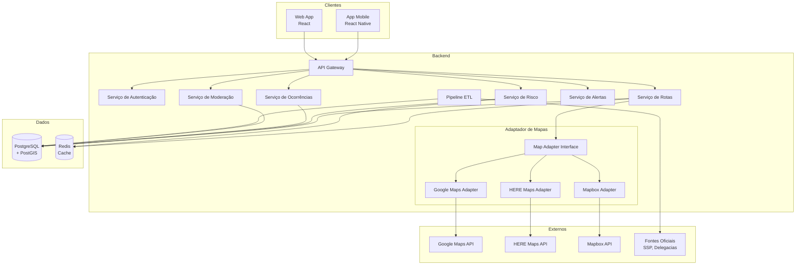
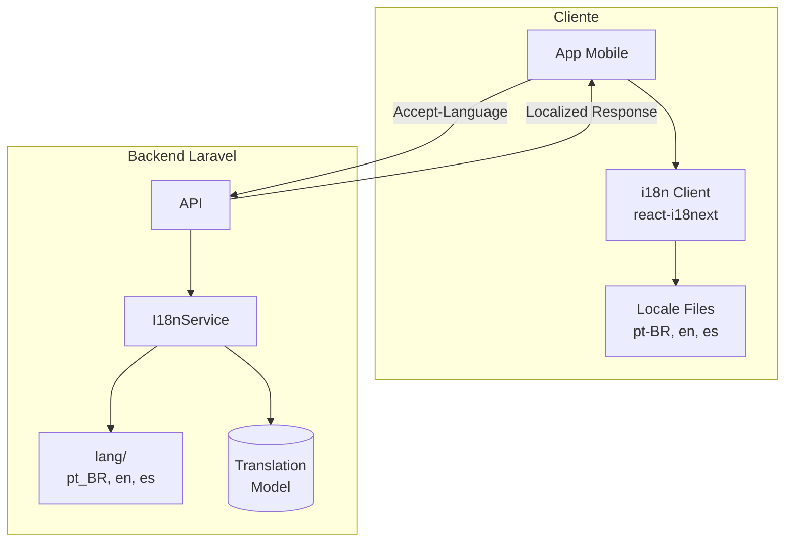

# Documento de Design - Walking Safely

## Visão Geral

O Walking Safely é uma plataforma de mapeamento e inteligência territorial de segurança para o Brasil. A arquitetura é composta por:

- **Aplicativo Mobile** (React Native): Interface do usuário para navegação, visualização de mapas e registro de ocorrências
- **Aplicação Web**: Consulta pública e painel administrativo (Laravel Blade/Livewire ou Inertia.js)
- **Backend API**: Laravel 11+ com PHP 8.3+
- **Banco de Dados**: PostgreSQL 16+ com PostGIS para dados geoespaciais, Redis para cache e filas

O sistema utiliza uma arquitetura de Adaptador de Mapas no backend que permite troca transparente entre Google Maps, HERE Maps e Mapbox.

## Stack Tecnológica

### Backend
| Componente | Tecnologia | Versão |
|------------|------------|--------|
| Linguagem | PHP | 8.3+ |
| Framework | Laravel | 11+ |
| ORM | Eloquent + Laravel Spatial | - |
| API | Laravel Sanctum (auth) + API Resources | - |
| Filas | Laravel Queue (Redis driver) | - |
| Cache | Laravel Cache (Redis driver) | - |
| Testes | PHPUnit + Pest | - |
| PBT | PhpQuickCheck ou eris/eris | - |

### Banco de Dados
| Componente | Tecnologia | Versão |
|------------|------------|--------|
| Principal | PostgreSQL | 16+ |
| Geoespacial | PostGIS | 3.4+ |
| Cache/Filas | Redis | 7+ |

### Mobile
| Componente | Tecnologia | Versão |
|------------|------------|--------|
| Framework | React Native | 0.73+ |
| Navegação | React Navigation | 6+ |
| Estado | Zustand ou Redux Toolkit | - |
| Mapas | react-native-maps | - |
| i18n | react-i18next | - |

### Infraestrutura
| Componente | Tecnologia |
|------------|------------|
| Containerização | Docker |
| Orquestração | Docker Compose (dev) / Kubernetes (prod) |
| CI/CD | GitHub Actions |
| Monitoramento | Laravel Telescope (dev) / Sentry (prod) |

## Arquitetura



## Componentes e Interfaces

### Estrutura de Diretórios Laravel

```
app/
├── Contracts/                    # Interfaces
│   ├── MapAdapterInterface.php
│   ├── RiskServiceInterface.php
│   └── ...
├── Services/                     # Serviços de domínio
│   ├── MapAdapters/
│   │   ├── GoogleMapsAdapter.php
│   │   ├── HereMapsAdapter.php
│   │   ├── MapboxAdapter.php
│   │   └── MapAdapterFactory.php
│   ├── RouteService.php
│   ├── RiskService.php
│   ├── OccurrenceService.php
│   ├── AlertService.php
│   └── I18nService.php
├── Models/                       # Eloquent Models
│   ├── Occurrence.php
│   ├── RiskIndex.php
│   ├── CrimeCategory.php
│   ├── User.php
│   └── ...
├── Http/
│   ├── Controllers/Api/
│   ├── Resources/               # API Resources
│   └── Requests/                # Form Requests
├── Jobs/                        # Queue Jobs
│   ├── RecalculateRiskIndex.php
│   ├── ProcessEtlImport.php
│   └── ExpireOldOccurrences.php
└── Policies/                    # Authorization
```

### 1. Adaptador de Mapas (Map Adapter)

Interface unificada para provedores de mapas:

```php
<?php

namespace App\Contracts;

interface MapAdapterInterface
{
    // Cálculo de rotas
    public function calculateRoute(
        Coordinates $origin, 
        Coordinates $destination, 
        ?RouteOptions $options = null
    ): Route;
    
    public function calculateAlternativeRoutes(
        Coordinates $origin, 
        Coordinates $destination, 
        int $count = 3
    ): array;
    
    // Geocodificação
    public function geocode(string $address): array;
    public function reverseGeocode(Coordinates $coordinates): Address;
    
    // Tráfego
    public function getTrafficData(Route $route): TrafficData;
    
    // Configuração
    public function getProviderName(): string;
    public function isAvailable(): bool;
}

class MapAdapterFactory
{
    public function createAdapter(string $provider): MapAdapterInterface;
    public function getConfiguredAdapter(): MapAdapterInterface;
    public function getFallbackAdapter(): ?MapAdapterInterface;
}
```

### 2. Serviço de Rotas

```php
<?php

namespace App\Services;

class RouteService
{
    public function __construct(
        private MapAdapterInterface $mapAdapter,
        private RiskService $riskService
    ) {}
    
    // Cálculo de rota com análise de risco
    public function calculateRouteWithRisk(
        Coordinates $origin, 
        Coordinates $destination, 
        bool $preferSafeRoute = false
    ): RouteWithRisk;
    
    // Recálculo durante navegação
    public function recalculateRoute(
        string $sessionId, 
        Coordinates $currentPosition
    ): RouteRecalculationResult;
    
    // Análise de risco do trajeto
    public function analyzeRouteRisk(Route $route): RouteRiskAnalysis;
}
```

### 3. Serviço de Risco

```php
<?php

namespace App\Services;

class RiskService
{
    // Cálculo de índice de risco
    public function calculateRiskIndex(string $regionId): float;
    public function recalculateRegionRisk(string $regionId): void;
    
    // Consulta de risco
    public function getRiskForRegion(string $regionId): RiskIndex;
    public function getRiskForCoordinates(Coordinates $coordinates): RiskIndex;
    public function getRiskAlongRoute(Route $route): array;
    
    // Atualização batch (via Job)
    public function dispatchRecalculateAllRisks(): void;
}
```

### 4. Serviço de Ocorrências

```php
<?php

namespace App\Services;

class OccurrenceService
{
    // CRUD de ocorrências
    public function createOccurrence(CreateOccurrenceDTO $data): Occurrence;
    public function getOccurrence(string $id): Occurrence;
    public function getOccurrencesInRegion(
        string $regionId, 
        ?OccurrenceFilters $filters = null
    ): Collection;
    
    // Validação
    public function validateOccurrenceLocation(
        Coordinates $coordinates, 
        Coordinates $userLocation
    ): bool;
    
    // Deduplicação
    public function findSimilarOccurrences(Occurrence $occurrence): Collection;
    public function mergeOccurrences(array $occurrenceIds): Occurrence;
    
    // Rate limiting
    public function canUserSubmit(string $userId): bool;
}
```

### 5. Serviço de Alertas

```php
<?php

namespace App\Services;

class AlertService
{
    // Verificação de alertas
    public function checkAlertConditions(
        Coordinates $position, 
        float $speed, 
        AlertPreferences $userPreferences
    ): array;
    
    // Cálculo de distância para alerta
    public function calculateAlertDistance(float $speed): float;
    
    // Preferências
    public function getUserAlertPreferences(string $userId): AlertPreferences;
    public function updateAlertPreferences(
        string $userId, 
        AlertPreferences $preferences
    ): void;
}
```

## Modelos de Dados

### Eloquent Models com PostGIS

### Ocorrência (Occurrence)

```php
<?php

namespace App\Models;

use Illuminate\Database\Eloquent\Model;
use MatanYadaev\EloquentSpatial\Objects\Point;
use MatanYadaev\EloquentSpatial\Traits\HasSpatial;

class Occurrence extends Model
{
    use HasSpatial;
    
    protected $fillable = [
        'timestamp',
        'location',        // PostGIS Point
        'crime_type_id',
        'severity',
        'confidence_score',
        'source',
        'source_id',
        'region_id',
        'status',
        'expires_at',
        'created_by',
    ];
    
    protected $casts = [
        'timestamp' => 'datetime',
        'location' => Point::class,
        'confidence_score' => 'integer',
        'expires_at' => 'datetime',
        'metadata' => 'array',
    ];
    
    // Relacionamentos
    public function crimeType(): BelongsTo;
    public function region(): BelongsTo;
    public function creator(): BelongsTo;
    public function validations(): HasMany;
}

// Enums
enum OccurrenceSeverity: string {
    case LOW = 'low';
    case MEDIUM = 'medium';
    case HIGH = 'high';
    case CRITICAL = 'critical';
}

enum OccurrenceSource: string {
    case COLLABORATIVE = 'collaborative';
    case OFFICIAL = 'official';
}

enum OccurrenceStatus: string {
    case ACTIVE = 'active';
    case EXPIRED = 'expired';
    case REJECTED = 'rejected';
    case MERGED = 'merged';
}
```

### Índice de Risco (RiskIndex)

```php
<?php

namespace App\Models;

class RiskIndex extends Model
{
    protected $fillable = [
        'region_id',
        'value',
        'calculated_at',
        'factors',
        'occurrence_count',
        'dominant_crime_type_id',
    ];
    
    protected $casts = [
        'value' => 'float',
        'calculated_at' => 'datetime',
        'factors' => 'array',  // JSON com RiskFactor[]
        'occurrence_count' => 'integer',
    ];
    
    public function region(): BelongsTo;
    public function dominantCrimeType(): BelongsTo;
}

// Value Object para fatores de risco
class RiskFactor
{
    public function __construct(
        public string $type,      // 'frequency', 'recency', 'severity', 'confidence'
        public float $weight,
        public float $contribution
    ) {}
    
    public function toArray(): array;
    public static function fromArray(array $data): self;
}
```

### Taxonomia de Crimes (CrimeCategory / CrimeType)

```php
<?php

namespace App\Models;

class CrimeCategory extends Model
{
    protected $fillable = [
        'name',
        'parent_id',
        'weight',
        'version',
    ];
    
    protected $casts = [
        'weight' => 'float',
        'version' => 'integer',
    ];
    
    // Relacionamentos
    public function parent(): BelongsTo;
    public function children(): HasMany;
    public function crimeTypes(): HasMany;
    public function translations(): HasMany;
}

class CrimeType extends Model
{
    protected $fillable = [
        'category_id',
        'name',
        'description',
    ];
    
    public function category(): BelongsTo;
    public function translations(): HasMany;
    public function externalMappings(): HasMany;
}

class CrimeTypeTranslation extends Model
{
    protected $fillable = [
        'crime_type_id',
        'locale',
        'name',
        'description',
    ];
}
```

### Rota (Route) - Value Object

```php
<?php

namespace App\ValueObjects;

class Route
{
    public function __construct(
        public string $id,
        public Coordinates $origin,
        public Coordinates $destination,
        public array $waypoints,
        public float $distance,      // metros
        public int $duration,        // segundos
        public string $polyline,
        public string $provider
    ) {}
    
    public function toArray(): array;
    public static function fromArray(array $data): self;
}

class RouteWithRisk extends Route
{
    public function __construct(
        Route $route,
        public float $maxRiskIndex,
        public float $averageRiskIndex,
        public array $riskRegions,
        public bool $requiresWarning,
        public ?string $warningMessage = null
    ) {
        parent::__construct(...get_object_vars($route));
    }
}

class Coordinates
{
    public function __construct(
        public float $latitude,
        public float $longitude
    ) {}
    
    public function toPoint(): Point;
    public static function fromPoint(Point $point): self;
}
```

### Usuário e Permissões

```php
<?php

namespace App\Models;

use Illuminate\Foundation\Auth\User as Authenticatable;
use Laravel\Sanctum\HasApiTokens;

class User extends Authenticatable
{
    use HasApiTokens;
    
    protected $fillable = [
        'email',
        'password',
        'role',
        'locale',
        'failed_login_attempts',
        'locked_until',
        'two_factor_enabled',
    ];
    
    protected $casts = [
        'role' => UserRole::class,
        'locked_until' => 'datetime',
        'two_factor_enabled' => 'boolean',
    ];
    
    public function isLocked(): bool;
    public function incrementFailedAttempts(): void;
    public function resetFailedAttempts(): void;
}

enum UserRole: string {
    case USER = 'user';
    case MODERATOR = 'moderator';
    case ADMIN = 'admin';
}

class AuditLog extends Model
{
    protected $fillable = [
        'user_id',
        'action',
        'target_type',
        'target_id',
        'details',
        'ip_address',
    ];
    
    protected $casts = [
        'details' => 'array',
    ];
}
```

## Propriedades de Corretude

*Uma propriedade é uma característica ou comportamento que deve ser verdadeiro em todas as execuções válidas de um sistema - essencialmente, uma declaração formal sobre o que o sistema deve fazer. Propriedades servem como ponte entre especificações legíveis por humanos e garantias de corretude verificáveis por máquina.*

### Propriedade 1: Round-trip de Serialização de Ocorrência
*Para qualquer* ocorrência válida, serializar para JSON e desserializar de volta deve produzir uma ocorrência equivalente à original.
**Valida: Requisitos 8.1, 8.2**

### Propriedade 2: Round-trip de Serialização de Índice de Risco
*Para qualquer* índice de risco válido, serializar para JSON e desserializar de volta deve produzir um índice equivalente ao original.
**Valida: Requisitos 19.1, 19.2**

### Propriedade 3: Round-trip de Serialização de Taxonomia
*Para qualquer* estrutura de taxonomia de crimes válida, serializar para JSON e desserializar de volta deve produzir uma estrutura equivalente à original.
**Valida: Requisito 13.4**

### Propriedade 4: Consistência do Adaptador de Mapas
*Para qualquer* provedor de mapas configurado (Google, HERE ou Mapbox), as APIs do Adaptador devem retornar resultados no mesmo formato de interface, independente do provedor subjacente.
**Valida: Requisitos 1.3, 1.4**

### Propriedade 5: Fallback de Provedor de Mapas
*Para qualquer* falha do provedor primário de mapas, o sistema deve acionar automaticamente o provedor de fallback configurado e retornar resultado válido.
**Valida: Requisito 1.5**

### Propriedade 6: Risco Máximo da Rota
*Para qualquer* rota calculada, o risco máximo retornado deve ser igual ao maior Índice de Risco entre todas as regiões atravessadas pelo trajeto.
**Valida: Requisito 2.4**

### Propriedade 7: Aviso de Risco na Rota
*Para qualquer* rota que passe por região com Índice de Risco >= 50, a resposta deve conter flag de aviso (requiresWarning = true) e mensagem de alerta.
**Valida: Requisito 2.6**

### Propriedade 8: Recálculo de Rota por Tráfego
*Para qualquer* sessão de navegação ativa onde o tempo estimado aumentar mais de 10%, o sistema deve recalcular a rota automaticamente.
**Valida: Requisito 3.1**

### Propriedade 9: Rota Segura Minimiza Risco
*Para qualquer* par origem/destino com opção "rota mais segura" habilitada, a rota retornada deve ter Índice de Risco máximo menor ou igual à rota padrão.
**Valida: Requisitos 4.1, 4.4**

### Propriedade 10: Limite de Distância para Rota Segura
*Para qualquer* rota segura calculada, a distância não deve exceder 120% da distância da rota mais curta.
**Valida: Requisito 4.3**

### Propriedade 11: Índice de Risco Válido
*Para qualquer* região geográfica, o Índice de Risco deve ser um valor entre 0 e 100 (inclusive).
**Valida: Requisito 5.1**

### Propriedade 12: Cálculo de Índice de Risco
*Para qualquer* conjunto de ocorrências em uma região, o Índice de Risco calculado deve considerar corretamente peso do tipo, frequência, recência e confiabilidade conforme a fórmula definida.
**Valida: Requisito 5.2**

### Propriedade 13: Score de Confiabilidade Inicial
*Para qualquer* ocorrência criada, fontes oficiais devem receber Score de Confiabilidade 5 e relatos colaborativos devem receber Score 2.
**Valida: Requisito 5.4**

### Propriedade 14: Alerta em Região de Alto Risco
*Para qualquer* entrada de usuário em região com Índice de Risco >= 70 durante navegação ativa, o sistema deve gerar alerta.
**Valida: Requisito 6.1**

### Propriedade 15: Distância de Antecedência do Alerta
*Para qualquer* velocidade acima de 40 km/h, o alerta deve ser emitido a pelo menos 500 metros de distância da Região de Alto Risco.
**Valida: Requisito 6.4**

### Propriedade 16: Campos Obrigatórios de Ocorrência
*Para qualquer* relato de ocorrência armazenado, deve conter timestamp, coordenadas GPS, tipo de ocorrência e nível de severidade.
**Valida: Requisito 7.1**

### Propriedade 17: Validação de Proximidade de Ocorrência
*Para qualquer* relato de ocorrência submetido, se as coordenadas estiverem a mais de 100 metros da localização do usuário, o relato deve ser rejeitado.
**Valida: Requisito 7.2**

### Propriedade 18: Aumento de Confiabilidade por Corroboração
*Para qualquer* par de relatos similares (mesmo tipo, dentro de 500m e 30min), o Score de Confiabilidade deve aumentar em 1 ponto, até máximo 4.
**Valida: Requisito 7.3**

### Propriedade 19: Expiração de Relatos Colaborativos
*Para qualquer* relato colaborativo não validado após 7 dias, o status deve ser alterado para 'expired'.
**Valida: Requisito 7.4**

### Propriedade 20: Rate Limiting de Relatos
*Para qualquer* usuário que tenha submetido 5 relatos na última hora, o 6º relato deve ser rejeitado.
**Valida: Requisito 7.5**

### Propriedade 21: Limite de Resultados de Geocodificação
*Para qualquer* busca de endereço, o sistema deve retornar no máximo 5 resultados.
**Valida: Requisito 9.1**

### Propriedade 22: Fallback para Cache de Geocodificação
*Para qualquer* falha do provedor de mapas em geocodificação, o sistema deve consultar o cache local.
**Valida: Requisito 9.3**

### Propriedade 23: Filtro de Mapa de Calor
*Para qualquer* filtro aplicado no mapa de calor (tipo de crime ou período), apenas ocorrências correspondentes devem ser incluídas na visualização.
**Valida: Requisito 10.2**

### Propriedade 24: Filtro de Série Temporal
*Para qualquer* filtro aplicado na série temporal (região ou tipo de crime), apenas dados correspondentes devem ser incluídos.
**Valida: Requisito 11.2**

### Propriedade 25: Agregação de Série Temporal
*Para qualquer* granularidade temporal selecionada (hora, dia, semana, mês), os dados devem ser agregados corretamente no período especificado.
**Valida: Requisito 11.3**

### Propriedade 26: Mapeamento de Taxonomia Externa
*Para qualquer* tipo de crime de fonte externa, deve existir um mapeamento válido para a Taxonomia de Crimes do sistema.
**Valida: Requisito 12.2**

### Propriedade 27: Deduplicação de Ocorrências
*Para qualquer* par de ocorrências com mesmo tipo, localização (< 100m) e timestamp (< 1h), o sistema deve identificá-las como duplicatas.
**Valida: Requisito 12.3**

### Propriedade 28: Hierarquia de Taxonomia Válida
*Para qualquer* estrutura de Taxonomia de Crimes, não deve haver ciclos e deve existir uma raiz única.
**Valida: Requisito 13.1**

### Propriedade 29: Versionamento de Taxonomia
*Para qualquer* modificação em categoria da taxonomia, uma nova versão deve ser criada com número incrementado.
**Valida: Requisito 13.2**

### Propriedade 30: Fila de Moderação para Relatos Suspeitos
*Para qualquer* relato sinalizado como suspeito pelo sistema de detecção, deve ser adicionado à fila de moderação.
**Valida: Requisito 14.1**

### Propriedade 31: Auditoria de Decisões de Moderação
*Para qualquer* decisão de moderação (aprovar/rejeitar), deve ser registrado timestamp, identificação do moderador e decisão.
**Valida: Requisito 14.2**

### Propriedade 32: Detecção de Padrão de Abuso
*Para qualquer* usuário que submeter múltiplos relatos similares em curto período, o sistema deve detectar como padrão de abuso.
**Valida: Requisito 14.3**

### Propriedade 33: Limpeza de Dados após Revogação de Permissão
*Para qualquer* revogação de permissão de localização, todos os dados de localização em cache devem ser limpos.
**Valida: Requisito 15.3**

### Propriedade 34: Níveis de Permissão Válidos
*Para qualquer* usuário do sistema, o nível de permissão deve ser um dos três válidos: 'user', 'moderator' ou 'admin'.
**Valida: Requisito 16.1**

### Propriedade 35: Auditoria de Alteração de Permissões
*Para qualquer* alteração de permissão de usuário, deve ser registrado em log de auditoria com timestamp e administrador responsável.
**Valida: Requisito 16.2**

### Propriedade 36: Bloqueio de Conta por Tentativas Falhas
*Para qualquer* usuário que exceder o limite de tentativas de login falhas, a conta deve ser bloqueada por 15 minutos.
**Valida: Requisito 16.4**

### Propriedade 37: Redução de Chamadas por Cota
*Para qualquer* situação onde a cota de API atingir 80%, as chamadas externas devem ser reduzidas em 50%.
**Valida: Requisito 17.2**

### Propriedade 38: Retry com Backoff Exponencial
*Para qualquer* falha de requisição ao provedor de mapas, o sistema deve tentar novamente até 3 vezes com backoff exponencial.
**Valida: Requisito 17.3**

### Propriedade 39: Round-trip de Serialização de Traduções
*Para qualquer* conjunto de traduções válido, exportar para JSON e importar de volta deve produzir traduções equivalentes às originais.
**Valida: Requisito 22.5**

### Propriedade 40: Fallback de Tradução
*Para qualquer* chave de tradução sem valor no idioma solicitado, o sistema deve retornar o valor no idioma padrão (pt-BR).
**Valida: Requisito 22.2**

### Propriedade 41: Consistência de Idioma na Interface
*Para qualquer* idioma selecionado pelo usuário, todas as strings da interface devem ser exibidas nesse idioma (ou fallback para padrão).
**Valida: Requisito 21.2**

### Propriedade 42: Versionamento de Traduções
*Para qualquer* modificação em uma tradução, uma nova versão deve ser criada com número incrementado e histórico preservado.
**Valida: Requisito 22.4**

### Propriedade 43: Tradução de Taxonomia de Crimes
*Para qualquer* tipo de crime exibido ao usuário, o nome deve estar no idioma selecionado pelo usuário.
**Valida: Requisito 21.7**

### Propriedade 44: Mensagens de Erro Localizadas
*Para qualquer* erro retornado pelo Backend, a resposta deve conter código de erro e chave de tradução para localização no cliente.
**Valida: Requisito 21.8**

## Internacionalização (i18n)

### Arquitetura de i18n



### Componentes de i18n

```php
<?php

namespace App\Services;

class I18nService
{
    // Tradução de strings
    public function translate(
        string $key, 
        string $locale, 
        array $params = []
    ): string;
    
    // Gestão de idiomas
    public function getSupportedLocales(): array;
    public function getDefaultLocale(): string;
    
    // Fallback
    public function getTranslationWithFallback(
        string $key, 
        string $locale
    ): string;
    
    // Tradução de taxonomia
    public function translateCrimeType(
        CrimeType $crimeType, 
        string $locale
    ): array;
}

// Model para traduções dinâmicas
class Translation extends Model
{
    protected $fillable = [
        'key',
        'locale',
        'value',
        'version',
        'updated_by',
    ];
    
    public function versions(): HasMany;
}

// API Resource com localização
class LocalizedErrorResource extends JsonResource
{
    public function toArray($request): array
    {
        return [
            'code' => $this->code,
            'translation_key' => $this->translationKey,
            'message' => __($this->translationKey, [], $request->getPreferredLanguage()),
            'params' => $this->params,
        ];
    }
}
```

### Modelo de Dados de Tradução

```php
<?php

// Migration para traduções
Schema::create('translations', function (Blueprint $table) {
    $table->id();
    $table->string('key')->index();
    $table->string('locale', 10)->index();
    $table->text('value');
    $table->integer('version')->default(1);
    $table->foreignId('updated_by')->nullable()->constrained('users');
    $table->timestamps();
    
    $table->unique(['key', 'locale']);
});

// Taxonomia de Crimes com traduções
class CrimeType extends Model
{
    public function getLocalizedName(string $locale): string
    {
        return $this->translations()
            ->where('locale', $locale)
            ->value('name') 
            ?? $this->translations()
                ->where('locale', config('app.fallback_locale'))
                ->value('name')
            ?? $this->name;
    }
}
```

### Idiomas Suportados

| Código | Idioma | Status |
|--------|--------|--------|
| pt_BR | Português (Brasil) | Padrão |
| en | Inglês | Suportado |
| es | Espanhol | Suportado |

## Tratamento de Erros

### Erros de Provedor de Mapas
- Timeout: Retry com backoff exponencial (1s, 2s, 4s)
- Indisponibilidade: Fallback para provedor alternativo
- Cota excedida: Priorizar cache, reduzir chamadas

### Erros de Validação
- Coordenadas inválidas: Retornar erro 400 com mensagem específica
- Relato fora de alcance: Rejeitar com código LOCATION_TOO_FAR
- Rate limit excedido: Retornar erro 429 com tempo de espera

### Erros de Dados
- Região sem índice de risco: Usar valor padrão 0
- Ocorrência sem tipo mapeado: Categorizar como "Outros"
- Falha de serialização: Log de erro e notificação

## Estratégia de Testes

### Testes Unitários (PHPUnit/Pest)
- Validação de modelos de dados
- Lógica de cálculo de índice de risco
- Validação de coordenadas e distâncias
- Serialização/desserialização

### Testes Baseados em Propriedades (Property-Based Testing)

O sistema utilizará **eris/eris** como biblioteca de testes baseados em propriedades para PHP.

```php
<?php

use Eris\Generator;
use Eris\TestTrait;

class OccurrenceSerializationTest extends TestCase
{
    use TestTrait;
    
    /**
     * **Feature: safe-navigation-app, Property 1: Round-trip de Serialização de Ocorrência**
     * **Valida: Requisitos 8.1, 8.2**
     */
    public function testOccurrenceSerializationRoundTrip(): void
    {
        $this->forAll(
            Generator\associative([
                'latitude' => Generator\float(-90, 90),
                'longitude' => Generator\float(-180, 180),
                'severity' => Generator\elements(['low', 'medium', 'high', 'critical']),
                'confidence_score' => Generator\int(1, 5),
            ])
        )
        ->withMaxSize(100)
        ->then(function ($data) {
            $occurrence = Occurrence::factory()->make($data);
            $json = $occurrence->toJson();
            $restored = Occurrence::fromJson($json);
            
            $this->assertEquals($occurrence->toArray(), $restored->toArray());
        });
    }
}
```

Configuração:
- Mínimo de 100 iterações por propriedade
- Cada teste deve referenciar explicitamente a propriedade do design: `**Feature: safe-navigation-app, Property {N}: {descrição}**`

Propriedades a testar:
1. Round-trip de serialização (Ocorrência, Índice de Risco, Taxonomia, Traduções)
2. Consistência do Adaptador de Mapas entre provedores
3. Cálculo correto de risco máximo em rotas
4. Validação de limites (distância, rate limiting, scores)
5. Deduplicação de ocorrências
6. Hierarquia válida de taxonomia
7. Fallback de traduções

### Testes de Integração (Feature Tests)
- Fluxo completo de cálculo de rota com risco
- Pipeline ETL de ingestão de dados
- Moderação de relatos
- Autenticação e autorização via Sanctum

### Estrutura de Testes

```
tests/
├── Unit/
│   ├── Services/
│   │   ├── RiskServiceTest.php
│   │   ├── RouteServiceTest.php
│   │   └── OccurrenceServiceTest.php
│   ├── Models/
│   │   └── OccurrenceTest.php
│   └── ValueObjects/
│       └── CoordinatesTest.php
├── Feature/
│   ├── Api/
│   │   ├── RouteControllerTest.php
│   │   ├── OccurrenceControllerTest.php
│   │   └── AuthControllerTest.php
│   └── Jobs/
│       └── RecalculateRiskIndexTest.php
└── Property/
    ├── SerializationPropertyTest.php
    ├── RiskCalculationPropertyTest.php
    └── ValidationPropertyTest.php
```
