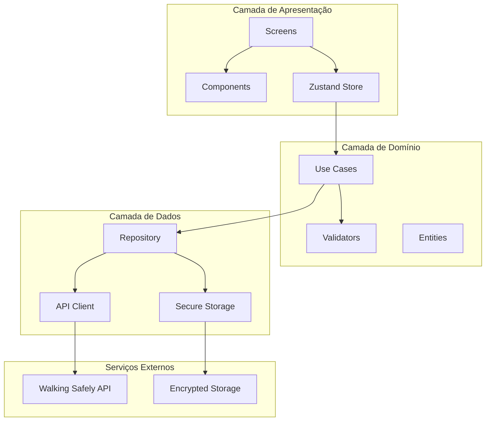
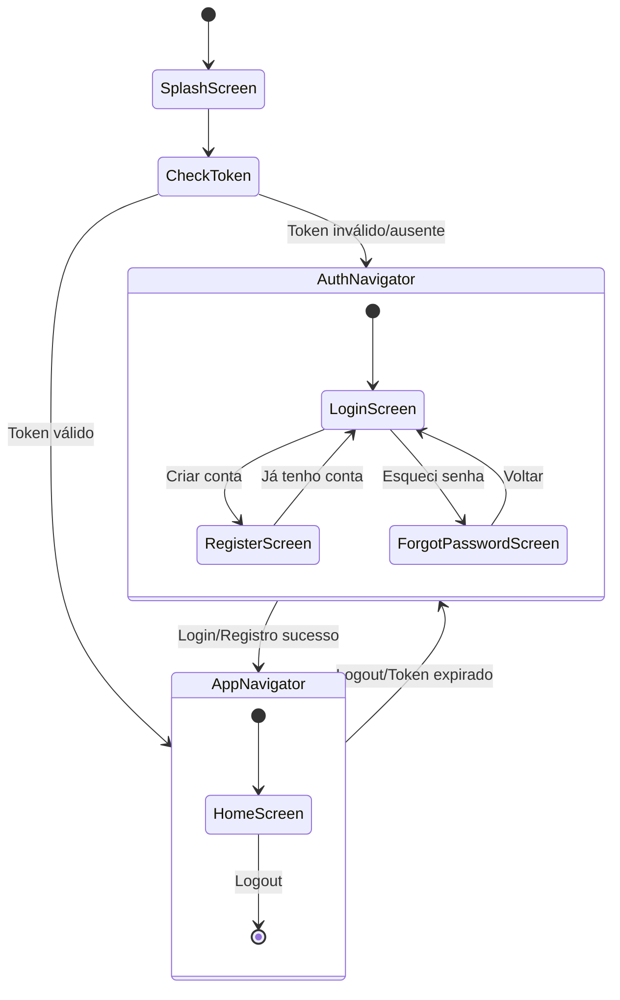

# Documento de Design

## Visão Geral

Este documento descreve a arquitetura e design técnico do WalkingSafelyApp, um aplicativo React Native focado na feature de autenticação. O app segue Clean Architecture com organização por features, utilizando TypeScript, Zustand, Tamagui e React Navigation.

## Arquitetura

### Estrutura de Pastas (Clean Architecture por Features)

```
WalkingSafelyApp/
├── src/
│   ├── app/                          # Configuração do app
│   │   ├── App.tsx                   # Componente raiz
│   │   ├── providers/                # Providers (Theme, Navigation)
│   │   └── navigation/               # Configuração de navegação
│   │       ├── RootNavigator.tsx
│   │       ├── AuthNavigator.tsx
│   │       └── AppNavigator.tsx
│   │
│   ├── features/                     # Features isoladas
│   │   └── auth/                     # Feature de autenticação
│   │       ├── data/                 # Camada de dados
│   │       │   ├── api/
│   │       │   │   └── authApi.ts
│   │       │   └── repositories/
│   │       │       └── authRepository.ts
│   │       ├── domain/               # Camada de domínio
│   │       │   ├── entities/
│   │       │   │   └── User.ts
│   │       │   ├── useCases/
│   │       │   │   ├── loginUseCase.ts
│   │       │   │   ├── registerUseCase.ts
│   │       │   │   └── forgotPasswordUseCase.ts
│   │       │   └── validators/
│   │       │       └── authValidators.ts
│   │       ├── presentation/         # Camada de apresentação
│   │       │   ├── screens/
│   │       │   │   ├── LoginScreen.tsx
│   │       │   │   ├── RegisterScreen.tsx
│   │       │   │   └── ForgotPasswordScreen.tsx
│   │       │   └── components/
│   │       │       └── AuthForm.tsx
│   │       └── store/
│   │           └── authStore.ts
│   │
│   ├── shared/                       # Código compartilhado
│   │   ├── components/               # Componentes reutilizáveis
│   │   │   ├── Button.tsx
│   │   │   ├── Input.tsx
│   │   │   ├── Card.tsx
│   │   │   └── Modal.tsx
│   │   ├── services/                 # Serviços compartilhados
│   │   │   ├── api/
│   │   │   │   ├── apiClient.ts
│   │   │   │   └── interceptors.ts
│   │   │   └── storage/
│   │   │       └── secureStorage.ts
│   │   ├── theme/                    # Design tokens e tema
│   │   │   ├── tokens.ts
│   │   │   ├── tamagui.config.ts
│   │   │   └── ThemeProvider.tsx
│   │   ├── hooks/                    # Hooks compartilhados
│   │   │   └── useTheme.ts
│   │   ├── types/                    # Tipos globais
│   │   │   └── api.types.ts
│   │   └── utils/                    # Utilitários
│   │       └── validators.ts
│   │
│   └── index.ts
│
├── package.json
├── tsconfig.json
├── babel.config.js
├── tamagui.config.ts
├── .eslintrc.js
└── .prettierrc
```

### Diagrama de Arquitetura



### Fluxo de Navegação



## Componentes e Interfaces

### API Client (Axios)

```typescript
// shared/services/api/apiClient.ts
import axios, { AxiosInstance, AxiosError } from 'axios';
import { getToken, clearToken } from '../storage/secureStorage';

interface ApiError {
  error: string;
  message: string;
  attempts_remaining?: number;
  locked_until?: string;
  remaining_seconds?: number;
  errors?: Record<string, string[]>;
}

interface ApiResponse<T> {
  data: T;
  message?: string;
  token?: string;
  token_type?: string;
}

const createApiClient = (): AxiosInstance => {
  const client = axios.create({
    baseURL: process.env.API_BASE_URL,
    timeout: 10000,
    headers: {
      'Content-Type': 'application/json',
      'Accept': 'application/json',
    },
  });

  // Request interceptor - adiciona Bearer Token
  client.interceptors.request.use(async (config) => {
    const token = await getToken();
    if (token) {
      config.headers.Authorization = `Bearer ${token}`;
    }
    return config;
  });

  // Response interceptor - tratamento de erros
  client.interceptors.response.use(
    (response) => response,
    async (error: AxiosError<ApiError>) => {
      if (error.response?.status === 401) {
        await clearToken();
        // Navegar para login (via evento ou callback)
      }
      return Promise.reject(error);
    }
  );

  return client;
};

export const apiClient = createApiClient();
export type { ApiError, ApiResponse };
```

### Auth API Service

```typescript
// features/auth/data/api/authApi.ts
import { apiClient, ApiResponse, ApiError } from '@/shared/services/api/apiClient';

interface LoginRequest {
  email: string;
  password: string;
  revoke_existing?: boolean;
}

interface RegisterRequest {
  name: string;
  email: string;
  password: string;
  password_confirmation: string;
  locale?: 'pt_BR' | 'en' | 'es';
}

interface ForgotPasswordRequest {
  email: string;
}

interface User {
  id: number;
  name: string;
  email: string;
  locale: string;
  created_at: string;
}

interface AuthResponse {
  data: User;
  token: string;
  token_type: string;
  message: string;
}

export const authApi = {
  login: async (data: LoginRequest): Promise<AuthResponse> => {
    const response = await apiClient.post<AuthResponse>('/auth/login', data);
    return response.data;
  },

  register: async (data: RegisterRequest): Promise<AuthResponse> => {
    const response = await apiClient.post<AuthResponse>('/auth/register', data);
    return response.data;
  },

  forgotPassword: async (data: ForgotPasswordRequest): Promise<{ message: string }> => {
    const response = await apiClient.post<{ message: string }>('/auth/forgot-password', data);
    return response.data;
  },

  logout: async (): Promise<{ message: string }> => {
    const response = await apiClient.post<{ message: string }>('/auth/logout');
    return response.data;
  },

  me: async (): Promise<{ data: User }> => {
    const response = await apiClient.get<{ data: User }>('/auth/me');
    return response.data;
  },
};

export type { LoginRequest, RegisterRequest, ForgotPasswordRequest, User, AuthResponse };
```

### Secure Storage Service

```typescript
// shared/services/storage/secureStorage.ts
import * as SecureStore from 'expo-secure-store';

const TOKEN_KEY = 'auth_token';
const USER_KEY = 'user_data';

export const secureStorage = {
  setToken: async (token: string): Promise<void> => {
    await SecureStore.setItemAsync(TOKEN_KEY, token);
  },

  getToken: async (): Promise<string | null> => {
    return await SecureStore.getItemAsync(TOKEN_KEY);
  },

  clearToken: async (): Promise<void> => {
    await SecureStore.deleteItemAsync(TOKEN_KEY);
  },

  setUser: async (user: object): Promise<void> => {
    await SecureStore.setItemAsync(USER_KEY, JSON.stringify(user));
  },

  getUser: async <T>(): Promise<T | null> => {
    const data = await SecureStore.getItemAsync(USER_KEY);
    return data ? JSON.parse(data) : null;
  },

  clearUser: async (): Promise<void> => {
    await SecureStore.deleteItemAsync(USER_KEY);
  },

  clearAll: async (): Promise<void> => {
    await SecureStore.deleteItemAsync(TOKEN_KEY);
    await SecureStore.deleteItemAsync(USER_KEY);
  },
};

// Aliases para compatibilidade
export const getToken = secureStorage.getToken;
export const setToken = secureStorage.setToken;
export const clearToken = secureStorage.clearToken;
```

### Auth Store (Zustand)

```typescript
// features/auth/store/authStore.ts
import { create } from 'zustand';
import { persist, createJSONStorage } from 'zustand/middleware';
import AsyncStorage from '@react-native-async-storage/async-storage';
import { User } from '../data/api/authApi';

interface AuthState {
  user: User | null;
  token: string | null;
  isAuthenticated: boolean;
  isLoading: boolean;
  error: string | null;
  attemptsRemaining: number | null;
  lockedUntil: string | null;
}

interface AuthActions {
  setUser: (user: User | null) => void;
  setToken: (token: string | null) => void;
  setLoading: (loading: boolean) => void;
  setError: (error: string | null) => void;
  setLockInfo: (attempts: number | null, lockedUntil: string | null) => void;
  login: (user: User, token: string) => void;
  logout: () => void;
  clearError: () => void;
}

type AuthStore = AuthState & AuthActions;

export const useAuthStore = create<AuthStore>()(
  persist(
    (set) => ({
      // State
      user: null,
      token: null,
      isAuthenticated: false,
      isLoading: false,
      error: null,
      attemptsRemaining: null,
      lockedUntil: null,

      // Actions
      setUser: (user) => set({ user }),
      setToken: (token) => set({ token, isAuthenticated: !!token }),
      setLoading: (isLoading) => set({ isLoading }),
      setError: (error) => set({ error }),
      setLockInfo: (attemptsRemaining, lockedUntil) => 
        set({ attemptsRemaining, lockedUntil }),
      
      login: (user, token) => set({
        user,
        token,
        isAuthenticated: true,
        error: null,
        attemptsRemaining: null,
        lockedUntil: null,
      }),
      
      logout: () => set({
        user: null,
        token: null,
        isAuthenticated: false,
        error: null,
        attemptsRemaining: null,
        lockedUntil: null,
      }),
      
      clearError: () => set({ error: null }),
    }),
    {
      name: 'auth-storage',
      storage: createJSONStorage(() => AsyncStorage),
      partialize: (state) => ({
        user: state.user,
        token: state.token,
        isAuthenticated: state.isAuthenticated,
      }),
    }
  )
);
```

### Validators

```typescript
// features/auth/domain/validators/authValidators.ts

export interface ValidationResult {
  isValid: boolean;
  error?: string;
}

export const validateEmail = (email: string): ValidationResult => {
  const trimmed = email.trim();
  
  if (!trimmed) {
    return { isValid: false, error: 'Email é obrigatório' };
  }
  
  const emailRegex = /^[^\s@]+@[^\s@]+\.[^\s@]+$/;
  if (!emailRegex.test(trimmed)) {
    return { isValid: false, error: 'Formato de email inválido' };
  }
  
  return { isValid: true };
};

export const validatePassword = (password: string): ValidationResult => {
  if (!password) {
    return { isValid: false, error: 'Senha é obrigatória' };
  }
  
  if (password.length < 8) {
    return { isValid: false, error: 'Senha deve ter pelo menos 8 caracteres' };
  }
  
  return { isValid: true };
};

export const validatePasswordConfirmation = (
  password: string,
  confirmation: string
): ValidationResult => {
  if (password !== confirmation) {
    return { isValid: false, error: 'Senhas não conferem' };
  }
  
  return { isValid: true };
};

export const validateName = (name: string): ValidationResult => {
  const trimmed = name.trim();
  
  if (!trimmed) {
    return { isValid: false, error: 'Nome é obrigatório' };
  }
  
  if (trimmed.length < 2) {
    return { isValid: false, error: 'Nome deve ter pelo menos 2 caracteres' };
  }
  
  return { isValid: true };
};

export const validateLoginForm = (email: string, password: string) => {
  const emailResult = validateEmail(email);
  const passwordResult = validatePassword(password);
  
  return {
    isValid: emailResult.isValid && passwordResult.isValid,
    errors: {
      email: emailResult.error,
      password: passwordResult.error,
    },
  };
};

export const validateRegisterForm = (
  name: string,
  email: string,
  password: string,
  passwordConfirmation: string
) => {
  const nameResult = validateName(name);
  const emailResult = validateEmail(email);
  const passwordResult = validatePassword(password);
  const confirmResult = validatePasswordConfirmation(password, passwordConfirmation);
  
  return {
    isValid: nameResult.isValid && emailResult.isValid && 
             passwordResult.isValid && confirmResult.isValid,
    errors: {
      name: nameResult.error,
      email: emailResult.error,
      password: passwordResult.error,
      passwordConfirmation: confirmResult.error,
    },
  };
};
```

## Modelos de Dados

### Entidades

```typescript
// features/auth/domain/entities/User.ts
export interface User {
  id: number;
  name: string;
  email: string;
  locale: 'pt_BR' | 'en' | 'es';
  created_at: string;
  updated_at?: string;
}

// shared/types/api.types.ts
export interface ApiErrorResponse {
  error: string;
  message: string;
  attempts_remaining?: number;
  locked_until?: string;
  remaining_seconds?: number;
}

export interface ValidationErrorResponse {
  message: string;
  errors: Record<string, string[]>;
}

export type Locale = 'pt_BR' | 'en' | 'es';
```

### Design Tokens

```typescript
// shared/theme/tokens.ts
export const tokens = {
  colors: {
    // Primary
    primary: {
      50: '#E3F2FD',
      100: '#BBDEFB',
      200: '#90CAF9',
      300: '#64B5F6',
      400: '#42A5F5',
      500: '#2196F3',
      600: '#1E88E5',
      700: '#1976D2',
      800: '#1565C0',
      900: '#0D47A1',
    },
    // Semantic
    success: '#4CAF50',
    warning: '#FF9800',
    error: '#F44336',
    info: '#2196F3',
    // Neutral
    background: {
      light: '#FFFFFF',
      dark: '#121212',
    },
    surface: {
      light: '#F5F5F5',
      dark: '#1E1E1E',
    },
    text: {
      primary: {
        light: '#212121',
        dark: '#FFFFFF',
      },
      secondary: {
        light: '#757575',
        dark: '#B0B0B0',
      },
    },
  },
  spacing: {
    xs: 4,
    sm: 8,
    md: 16,
    lg: 24,
    xl: 32,
    xxl: 48,
  },
  typography: {
    fontFamily: {
      regular: 'Inter-Regular',
      medium: 'Inter-Medium',
      semiBold: 'Inter-SemiBold',
      bold: 'Inter-Bold',
    },
    fontSize: {
      xs: 12,
      sm: 14,
      md: 16,
      lg: 18,
      xl: 20,
      xxl: 24,
      xxxl: 32,
    },
    lineHeight: {
      tight: 1.2,
      normal: 1.5,
      relaxed: 1.75,
    },
  },
  borderRadius: {
    sm: 4,
    md: 8,
    lg: 12,
    xl: 16,
    full: 9999,
  },
  shadow: {
    sm: {
      shadowColor: '#000',
      shadowOffset: { width: 0, height: 1 },
      shadowOpacity: 0.18,
      shadowRadius: 1.0,
      elevation: 1,
    },
    md: {
      shadowColor: '#000',
      shadowOffset: { width: 0, height: 2 },
      shadowOpacity: 0.23,
      shadowRadius: 2.62,
      elevation: 4,
    },
    lg: {
      shadowColor: '#000',
      shadowOffset: { width: 0, height: 4 },
      shadowOpacity: 0.30,
      shadowRadius: 4.65,
      elevation: 8,
    },
  },
};

export type Tokens = typeof tokens;
```

## Propriedades de Corretude

*Uma propriedade é uma característica ou comportamento que deve ser verdadeiro em todas as execuções válidas de um sistema - essencialmente, uma declaração formal sobre o que o sistema deve fazer. Propriedades servem como ponte entre especificações legíveis por humanos e garantias de corretude verificáveis por máquina.*

### Property 1: Validação de Email

*Para qualquer* string de entrada, a função de validação de email DEVE retornar `isValid: true` se e somente se a string contém exatamente um `@`, tem pelo menos um caractere antes do `@`, tem pelo menos um `.` após o `@`, e não contém espaços.

**Valida: Requisitos 7.2, 8.3, 9.2**

### Property 2: Validação de Senha

*Para qualquer* string de entrada, a função de validação de senha DEVE retornar `isValid: true` se e somente se a string tem pelo menos 8 caracteres e não é vazia.

**Valida: Requisitos 7.3, 8.4**

### Property 3: Confirmação de Senha

*Para quaisquer* duas strings (senha e confirmação), a função de validação DEVE retornar `isValid: true` se e somente se as duas strings são exatamente iguais.

**Valida: Requisito 8.5**

### Property 4: Validação de Nome

*Para qualquer* string de entrada, a função de validação de nome DEVE retornar `isValid: true` se e somente se a string (após trim) tem pelo menos 2 caracteres.

**Valida: Requisito 8.2**

### Property 5: Round-Trip de Token Storage

*Para qualquer* token válido (string não vazia), armazenar o token e depois recuperá-lo DEVE produzir exatamente o mesmo token.

**Valida: Requisitos 2.5, 10.1**

### Property 6: Navegação por Estado de Autenticação

*Para qualquer* estado de autenticação (autenticado ou não autenticado), o navegador exibido DEVE corresponder ao estado: Auth_Navigator quando não autenticado, App_Navigator quando autenticado.

**Valida: Requisitos 4.3, 4.4**

### Property 7: Atualização de Tema

*Para qualquer* mudança de tema (light para dark ou dark para light), todos os componentes que usam tokens de tema DEVEM refletir o novo tema imediatamente após a mudança.

**Valida: Requisito 5.4**

### Property 8: Tratamento de Erros de API

*Para qualquer* código de erro HTTP (401, 422, 423, 503), o interceptor de resposta DEVE retornar um objeto de erro tipado com a estrutura correta para aquele código específico.

**Valida: Requisitos 3.3, 3.5**

### Property 9: Injeção de Token de Autenticação

*Para qualquer* requisição HTTP quando existe um token armazenado, o interceptor de requisição DEVE adicionar o header `Authorization: Bearer {token}` à requisição.

**Valida: Requisito 3.4**

### Property 10: Notificação de Mudança de Estado

*Para qualquer* mudança de estado no Zustand store, todos os componentes inscritos naquele slice de estado DEVEM ser notificados e re-renderizados com o novo valor.

**Valida: Requisito 2.3**

## Tratamento de Erros

### Códigos de Erro da API

| Código | Tipo | Tratamento |
|--------|------|------------|
| 401 | Não autenticado / Credenciais inválidas | Limpar token, redirecionar para login, exibir mensagem com tentativas restantes |
| 422 | Erro de validação | Exibir mensagens de erro por campo |
| 423 | Conta bloqueada | Exibir tempo restante de bloqueio |
| 503 | Serviço indisponível | Exibir mensagem de erro genérica, sugerir tentar novamente |

### Estrutura de Erro Padronizada

```typescript
// shared/types/errors.ts
export interface AppError {
  code: string;
  message: string;
  field?: string;
  details?: Record<string, unknown>;
}

export const createAppError = (
  code: string,
  message: string,
  field?: string,
  details?: Record<string, unknown>
): AppError => ({
  code,
  message,
  field,
  details,
});

export const parseApiError = (error: unknown): AppError => {
  if (axios.isAxiosError(error)) {
    const response = error.response;
    
    if (response?.status === 401) {
      return createAppError(
        'AUTH_INVALID_CREDENTIALS',
        response.data?.message || 'Credenciais inválidas',
        undefined,
        { attemptsRemaining: response.data?.attempts_remaining }
      );
    }
    
    if (response?.status === 422) {
      return createAppError(
        'VALIDATION_ERROR',
        response.data?.message || 'Erro de validação',
        undefined,
        { errors: response.data?.errors }
      );
    }
    
    if (response?.status === 423) {
      return createAppError(
        'ACCOUNT_LOCKED',
        response.data?.message || 'Conta bloqueada',
        undefined,
        {
          lockedUntil: response.data?.locked_until,
          remainingSeconds: response.data?.remaining_seconds,
        }
      );
    }
  }
  
  return createAppError(
    'UNKNOWN_ERROR',
    'Ocorreu um erro inesperado'
  );
};
```

## Estratégia de Testes

### Abordagem Dual de Testes

O projeto utiliza duas abordagens complementares de testes:

1. **Testes Unitários**: Verificam exemplos específicos, casos de borda e condições de erro
2. **Testes de Propriedade (PBT)**: Verificam propriedades universais em muitas entradas geradas

### Biblioteca de Property-Based Testing

- **Biblioteca**: fast-check
- **Configuração**: Mínimo de 100 iterações por teste de propriedade
- **Formato de Tag**: `Feature: walking-safely-app, Property {N}: {título}`

### Estrutura de Testes

```
__tests__/
├── unit/
│   ├── validators/
│   │   └── authValidators.test.ts
│   ├── store/
│   │   └── authStore.test.ts
│   └── services/
│       └── apiClient.test.ts
├── property/
│   ├── validators.property.test.ts
│   ├── storage.property.test.ts
│   └── navigation.property.test.ts
└── integration/
    └── auth.integration.test.ts
```

### Exemplos de Testes de Propriedade

```typescript
// __tests__/property/validators.property.test.ts
import fc from 'fast-check';
import { validateEmail, validatePassword, validateName } from '@/features/auth/domain/validators/authValidators';

describe('Auth Validators - Property Tests', () => {
  // Feature: walking-safely-app, Property 1: Validação de Email
  it('should validate emails correctly for all inputs', () => {
    fc.assert(
      fc.property(fc.string(), (input) => {
        const result = validateEmail(input);
        const hasAt = input.includes('@');
        const parts = input.split('@');
        const hasValidFormat = hasAt && 
          parts.length === 2 && 
          parts[0].length > 0 && 
          parts[1].includes('.') &&
          !input.includes(' ');
        
        return result.isValid === hasValidFormat;
      }),
      { numRuns: 100 }
    );
  });

  // Feature: walking-safely-app, Property 2: Validação de Senha
  it('should validate passwords correctly for all inputs', () => {
    fc.assert(
      fc.property(fc.string(), (input) => {
        const result = validatePassword(input);
        const isValidLength = input.length >= 8;
        
        return result.isValid === isValidLength;
      }),
      { numRuns: 100 }
    );
  });

  // Feature: walking-safely-app, Property 4: Validação de Nome
  it('should validate names correctly for all inputs', () => {
    fc.assert(
      fc.property(fc.string(), (input) => {
        const result = validateName(input);
        const trimmed = input.trim();
        const isValidLength = trimmed.length >= 2;
        
        return result.isValid === isValidLength;
      }),
      { numRuns: 100 }
    );
  });
});
```
