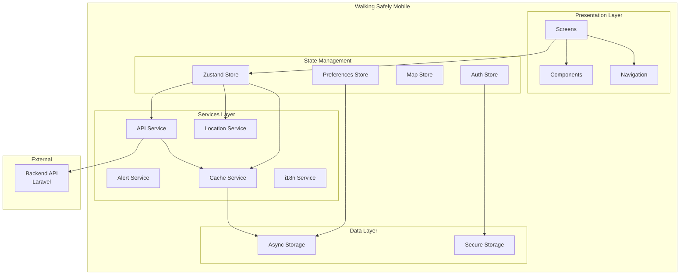
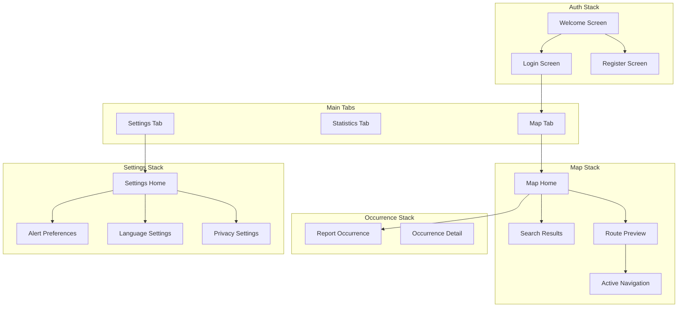

# Documento de Design - Walking Safely Mobile

## Visão Geral

O Walking Safely Mobile é um aplicativo React Native que serve como interface principal para usuários da plataforma Walking Safely. O app consome exclusivamente as APIs do backend Laravel, não fazendo chamadas diretas a provedores de mapas externos.

### Princípios de Arquitetura

- **API-First**: Todas as funcionalidades de mapas, rotas e dados vêm do backend
- **Offline-Aware**: Funcionalidades degradam graciosamente sem conexão
- **Privacy-First**: Dados de localização são tratados com cuidado conforme LGPD
- **i18n-Ready**: Toda string de interface é externalizável

## Stack Tecnológica

| Componente | Tecnologia | Versão |
|------------|------------|--------|
| Framework | React Native | 0.73+ |
| Linguagem | TypeScript | 5.0+ |
| Navegação | React Navigation | 6+ |
| Estado Global | Zustand | 4+ |
| Mapas | react-native-maps | 1.8+ |
| i18n | react-i18next | 14+ |
| HTTP Client | Axios | 1.6+ |
| Storage | @react-native-async-storage/async-storage | 1.21+ |
| Secure Storage | react-native-keychain | 8+ |
| Geolocation | @react-native-community/geolocation | 3+ |
| Permissions | react-native-permissions | 4+ |

## Arquitetura



## Estrutura de Diretórios

```
src/
├── components/           # Componentes reutilizáveis
│   ├── common/          # Botões, inputs, modals
│   ├── map/             # Componentes de mapa
│   └── navigation/      # Headers, tabs
├── screens/             # Telas do app
│   ├── auth/            # Login, Register
│   ├── main/            # Home, Map
│   ├── navigation/      # Active navigation
│   ├── occurrence/      # Report, Details
│   └── settings/        # Preferences, Privacy
├── navigation/          # Configuração de navegação
│   ├── RootNavigator.tsx
│   ├── AuthNavigator.tsx
│   ├── MainNavigator.tsx
│   └── types.ts
├── store/               # Zustand stores
│   ├── authStore.ts
│   ├── mapStore.ts
│   ├── navigationStore.ts
│   ├── preferencesStore.ts
│   └── index.ts
├── services/            # Serviços
│   ├── api/
│   │   ├── client.ts
│   │   ├── routes.ts
│   │   ├── occurrences.ts
│   │   ├── geocoding.ts
│   │   └── auth.ts
│   ├── location.ts
│   ├── alerts.ts
│   └── cache.ts
├── hooks/               # Custom hooks
│   ├── useLocation.ts
│   ├── useAuth.ts
│   ├── useNavigation.ts
│   └── useAlerts.ts
├── i18n/                # Internacionalização
│   ├── index.ts
│   └── locales/
│       ├── pt-BR.json
│       ├── en.json
│       └── es.json
├── types/               # TypeScript types
│   ├── api.ts
│   ├── navigation.ts
│   └── models.ts
├── utils/               # Utilitários
│   ├── constants.ts
│   ├── helpers.ts
│   └── validators.ts
├── theme/               # Estilos globais
│   ├── colors.ts
│   ├── typography.ts
│   └── spacing.ts
└── App.tsx
```

## Componentes e Interfaces

### 1. API Service

```typescript
// src/services/api/client.ts
import axios, { AxiosInstance, AxiosRequestConfig } from 'axios';
import { getLocale } from '../../i18n';
import { useAuthStore } from '../../store/authStore';

interface ApiClient {
  get<T>(url: string, config?: AxiosRequestConfig): Promise<T>;
  post<T>(url: string, data?: unknown, config?: AxiosRequestConfig): Promise<T>;
  put<T>(url: string, data?: unknown, config?: AxiosRequestConfig): Promise<T>;
  delete<T>(url: string, config?: AxiosRequestConfig): Promise<T>;
}

const createApiClient = (): ApiClient => {
  const instance: AxiosInstance = axios.create({
    baseURL: Config.API_BASE_URL,
    timeout: 10000,
  });

  // Interceptor para adicionar token e locale
  instance.interceptors.request.use((config) => {
    const token = useAuthStore.getState().token;
    const locale = getLocale();
    
    config.headers['Accept-Language'] = locale;
    if (token) {
      config.headers['Authorization'] = `Bearer ${token}`;
    }
    return config;
  });

  // Interceptor para tratamento de erros
  instance.interceptors.response.use(
    (response) => response.data,
    (error) => {
      // Retry logic, error transformation
      return Promise.reject(transformError(error));
    }
  );

  return instance;
};
```

### 2. Route Service

```typescript
// src/services/api/routes.ts
interface RouteRequest {
  origin: Coordinates;
  destination: Coordinates;
  preferSafeRoute?: boolean;
}

interface RouteResponse {
  id: string;
  polyline: string;
  distance: number;      // metros
  duration: number;      // segundos
  maxRiskIndex: number;
  averageRiskIndex: number;
  requiresWarning: boolean;
  warningMessage?: string;
  instructions: RouteInstruction[];
}

interface RouteInstruction {
  text: string;
  distance: number;
  duration: number;
  maneuver: string;
  coordinates: Coordinates;
}

const routeService = {
  calculateRoute: (request: RouteRequest): Promise<RouteResponse> => {
    return apiClient.post('/api/routes', request);
  },
  
  recalculateRoute: (sessionId: string, currentPosition: Coordinates): Promise<RouteRecalculationResponse> => {
    return apiClient.post('/api/routes/recalculate', { sessionId, currentPosition });
  },
  
  getAlternativeRoutes: (request: RouteRequest): Promise<RouteResponse[]> => {
    return apiClient.post('/api/routes/alternatives', request);
  },
};
```

### 3. Location Service

```typescript
// src/services/location.ts
import Geolocation from '@react-native-community/geolocation';
import { check, request, PERMISSIONS, RESULTS } from 'react-native-permissions';

interface LocationService {
  getCurrentPosition(): Promise<Coordinates>;
  watchPosition(callback: (position: Coordinates) => void): number;
  clearWatch(watchId: number): void;
  requestPermission(): Promise<boolean>;
  checkPermission(): Promise<boolean>;
}

const locationService: LocationService = {
  getCurrentPosition: () => {
    return new Promise((resolve, reject) => {
      Geolocation.getCurrentPosition(
        (position) => resolve({
          latitude: position.coords.latitude,
          longitude: position.coords.longitude,
        }),
        (error) => reject(error),
        { enableHighAccuracy: true, timeout: 15000, maximumAge: 10000 }
      );
    });
  },
  
  watchPosition: (callback) => {
    return Geolocation.watchPosition(
      (position) => callback({
        latitude: position.coords.latitude,
        longitude: position.coords.longitude,
      }),
      (error) => console.error(error),
      { enableHighAccuracy: true, distanceFilter: 10 }
    );
  },
  
  requestPermission: async () => {
    const permission = Platform.OS === 'ios' 
      ? PERMISSIONS.IOS.LOCATION_WHEN_IN_USE 
      : PERMISSIONS.ANDROID.ACCESS_FINE_LOCATION;
    
    const result = await request(permission);
    return result === RESULTS.GRANTED;
  },
};
```

### 4. Alert Service

```typescript
// src/services/alerts.ts
interface AlertService {
  checkAlertConditions(
    position: Coordinates,
    speed: number,
    route: RouteResponse
  ): Alert | null;
  
  calculateAlertDistance(speed: number): number;
  
  playAlertSound(): void;
}

interface Alert {
  type: 'high_risk' | 'route_change' | 'traffic';
  title: string;
  message: string;
  riskIndex?: number;
  crimeType?: string;
}

const alertService: AlertService = {
  checkAlertConditions: (position, speed, route) => {
    // Verificar proximidade de regiões de alto risco
    // Calcular distância baseada na velocidade
    const alertDistance = alertService.calculateAlertDistance(speed);
    // Retornar alerta se necessário
  },
  
  calculateAlertDistance: (speed) => {
    // Mínimo 500m para velocidades > 40km/h
    if (speed > 40) {
      return Math.max(500, speed * 15); // 15 segundos de antecedência
    }
    return 200; // 200m para velocidades baixas
  },
};
```

### 5. Zustand Stores

```typescript
// src/store/authStore.ts
import { create } from 'zustand';
import { persist, createJSONStorage } from 'zustand/middleware';
import AsyncStorage from '@react-native-async-storage/async-storage';

interface AuthState {
  token: string | null;
  user: User | null;
  isAuthenticated: boolean;
  isLoading: boolean;
  
  login: (email: string, password: string) => Promise<void>;
  logout: () => Promise<void>;
  loadStoredAuth: () => Promise<void>;
}

export const useAuthStore = create<AuthState>()(
  persist(
    (set, get) => ({
      token: null,
      user: null,
      isAuthenticated: false,
      isLoading: false,
      
      login: async (email, password) => {
        set({ isLoading: true });
        try {
          const response = await authService.login(email, password);
          set({ 
            token: response.token, 
            user: response.user, 
            isAuthenticated: true 
          });
        } finally {
          set({ isLoading: false });
        }
      },
      
      logout: async () => {
        await authService.logout();
        set({ token: null, user: null, isAuthenticated: false });
      },
    }),
    {
      name: 'auth-storage',
      storage: createJSONStorage(() => AsyncStorage),
    }
  )
);

// src/store/mapStore.ts
interface MapState {
  currentPosition: Coordinates | null;
  destination: Coordinates | null;
  currentRoute: RouteResponse | null;
  isNavigating: boolean;
  heatmapEnabled: boolean;
  heatmapData: HeatmapPoint[];
  
  setDestination: (coords: Coordinates) => void;
  calculateRoute: (preferSafe?: boolean) => Promise<void>;
  startNavigation: () => void;
  stopNavigation: () => void;
  toggleHeatmap: () => void;
  loadHeatmapData: (bounds: MapBounds, filters?: HeatmapFilters) => Promise<void>;
}

// src/store/navigationStore.ts
interface NavigationState {
  sessionId: string | null;
  currentInstruction: RouteInstruction | null;
  remainingDistance: number;
  remainingDuration: number;
  speed: number;
  
  updatePosition: (position: Coordinates) => void;
  checkForRecalculation: () => Promise<void>;
}

// src/store/preferencesStore.ts
interface PreferencesState {
  locale: string;
  alertsEnabled: boolean;
  soundEnabled: boolean;
  alertTypes: string[];
  alertSchedule: AlertSchedule | null;
  
  setLocale: (locale: string) => void;
  updateAlertPreferences: (prefs: Partial<AlertPreferences>) => Promise<void>;
  loadPreferences: () => Promise<void>;
}
```

## Modelos de Dados

### Types

```typescript
// src/types/models.ts
interface Coordinates {
  latitude: number;
  longitude: number;
}

interface User {
  id: string;
  email: string;
  name: string;
  role: 'user' | 'moderator' | 'admin';
  locale: string;
}

interface Occurrence {
  id: string;
  timestamp: string;
  location: Coordinates;
  crimeType: CrimeType;
  severity: 'low' | 'medium' | 'high' | 'critical';
  confidenceScore: number;
  source: 'collaborative' | 'official';
}

interface CrimeType {
  id: string;
  name: string;
  categoryId: string;
  localizedName?: string;
}

interface CrimeCategory {
  id: string;
  name: string;
  parentId: string | null;
  localizedName?: string;
}

interface HeatmapPoint {
  latitude: number;
  longitude: number;
  weight: number;
}

interface AlertPreferences {
  enabled: boolean;
  soundEnabled: boolean;
  types: string[];
  schedule: AlertSchedule | null;
}

interface AlertSchedule {
  startTime: string; // HH:mm
  endTime: string;   // HH:mm
  daysOfWeek: number[]; // 0-6
}

// src/types/api.ts
interface ApiError {
  code: string;
  translationKey: string;
  message: string;
  params?: Record<string, string>;
}

interface PaginatedResponse<T> {
  data: T[];
  meta: {
    currentPage: number;
    lastPage: number;
    perPage: number;
    total: number;
  };
}
```

## Propriedades de Corretude

*Uma propriedade é uma característica ou comportamento que deve ser verdadeiro em todas as execuções válidas de um sistema.*

### Propriedade 1: Token de Autenticação Persistido
*Para qualquer* login bem-sucedido, o token deve ser armazenado de forma segura e recuperado corretamente ao reiniciar o app.
**Valida: Requisitos 2.2, 2.6**

### Propriedade 2: Header Accept-Language Consistente
*Para qualquer* requisição ao Backend, o header Accept-Language deve corresponder ao idioma selecionado pelo usuário.
**Valida: Requisito 12.5**

### Propriedade 3: Polyline Renderizada Corretamente
*Para qualquer* rota retornada pelo Backend, a polyline deve ser decodificada e renderizada no mapa sem distorções.
**Valida: Requisito 5.2**

### Propriedade 4: Aviso de Risco Exibido
*Para qualquer* rota com Índice de Risco >= 50, o app deve exibir aviso visual destacado.
**Valida: Requisito 5.4**

### Propriedade 5: Alerta com Antecedência Correta
*Para qualquer* velocidade > 40km/h, alertas de região de alto risco devem ser emitidos a pelo menos 500m de distância.
**Valida: Requisito 7.4**

### Propriedade 6: Debounce de Busca
*Para qualquer* sequência de digitação na busca, apenas uma requisição deve ser enviada após 500ms de inatividade.
**Valida: Requisito 4.1**

### Propriedade 7: Limite de Resultados de Busca
*Para qualquer* busca de endereço, no máximo 5 resultados devem ser exibidos.
**Valida: Requisito 4.2**

### Propriedade 8: Recálculo Automático de Rota
*Para qualquer* desvio da rota durante navegação ativa, o app deve solicitar recálculo ao Backend.
**Valida: Requisito 6.5**

### Propriedade 9: Atualização de Tráfego Periódica
*Para qualquer* sessão de navegação ativa, o app deve consultar o Backend a cada 60 segundos.
**Valida: Requisito 8.1**

### Propriedade 10: Filtro de Mapa de Calor
*Para qualquer* filtro aplicado no mapa de calor, apenas dados correspondentes devem ser exibidos.
**Valida: Requisitos 9.4, 9.5**

### Propriedade 11: Campos Obrigatórios de Ocorrência
*Para qualquer* relato de ocorrência submetido, deve conter coordenadas GPS, timestamp, tipo de crime e severidade.
**Valida: Requisito 10.2, 10.3**

### Propriedade 12: Rate Limiting Visual
*Para qualquer* usuário que atingir limite de 5 relatos/hora, o contador deve refletir corretamente e bloquear novos envios.
**Valida: Requisito 10.7**

### Propriedade 13: Troca de Idioma Imediata
*Para qualquer* mudança de idioma nas configurações, toda a interface deve ser atualizada imediatamente.
**Valida: Requisito 12.4**

### Propriedade 14: Fallback de Tradução
*Para qualquer* string sem tradução no idioma selecionado, o app deve exibir a versão em português.
**Valida: Requisito 12.7**

### Propriedade 15: Permissão de Localização Respeitada
*Para qualquer* revogação de permissão de localização, o app deve parar de acessar GPS imediatamente.
**Valida: Requisito 13.3**

### Propriedade 16: Retry de Requisições
*Para qualquer* falha de rede, o app deve tentar novamente até 3 vezes antes de exibir erro.
**Valida: Requisito 14.4**

### Propriedade 17: Cache de Taxonomia
*Para qualquer* acesso à taxonomia de crimes, dados em cache devem ser usados se disponíveis e válidos.
**Valida: Requisito 15.3**

### Propriedade 18: Wake Lock Durante Navegação
*Para qualquer* sessão de navegação ativa, a tela deve permanecer ligada.
**Valida: Requisito 6.7**

### Propriedade 19: Estado Preservado entre Tabs
*Para qualquer* navegação entre tabs, o estado da tela anterior deve ser preservado.
**Valida: Requisito 16.3**

### Propriedade 20: Mensagem de Erro Localizada
*Para qualquer* erro retornado pelo Backend, a mensagem exibida deve estar no idioma do usuário.
**Valida: Requisito 14.3**

## Navegação



## Tratamento de Erros

### Erros de Rede
- Timeout: Retry automático até 3 vezes com backoff
- Sem conexão: Banner informativo, funcionalidades offline quando possível
- Erro 5xx: Mensagem genérica com opção de retry

### Erros de API
- 401 Unauthorized: Redirecionar para login
- 403 Forbidden: Mensagem de permissão negada
- 422 Validation: Exibir erros de validação nos campos
- 429 Rate Limit: Exibir tempo de espera

### Erros de Localização
- Permissão negada: Modo limitado com localização manual
- GPS indisponível: Usar última localização conhecida
- Timeout: Retry com timeout maior

## Estratégia de Testes

### Testes Unitários (Jest)
- Funções utilitárias
- Transformações de dados
- Lógica de stores
- Serviços isolados

### Testes de Componentes (React Native Testing Library)
- Renderização de componentes
- Interações do usuário
- Estados de loading/error

### Testes de Integração
- Fluxos de navegação
- Integração com stores
- Chamadas de API mockadas

### Testes E2E (Detox)
- Fluxo de login
- Cálculo de rota
- Registro de ocorrência
- Navegação ativa

### Estrutura de Testes

```
__tests__/
├── unit/
│   ├── services/
│   ├── store/
│   └── utils/
├── components/
│   ├── common/
│   └── map/
├── integration/
│   └── flows/
└── e2e/
    ├── auth.e2e.ts
    ├── navigation.e2e.ts
    └── occurrence.e2e.ts
```

